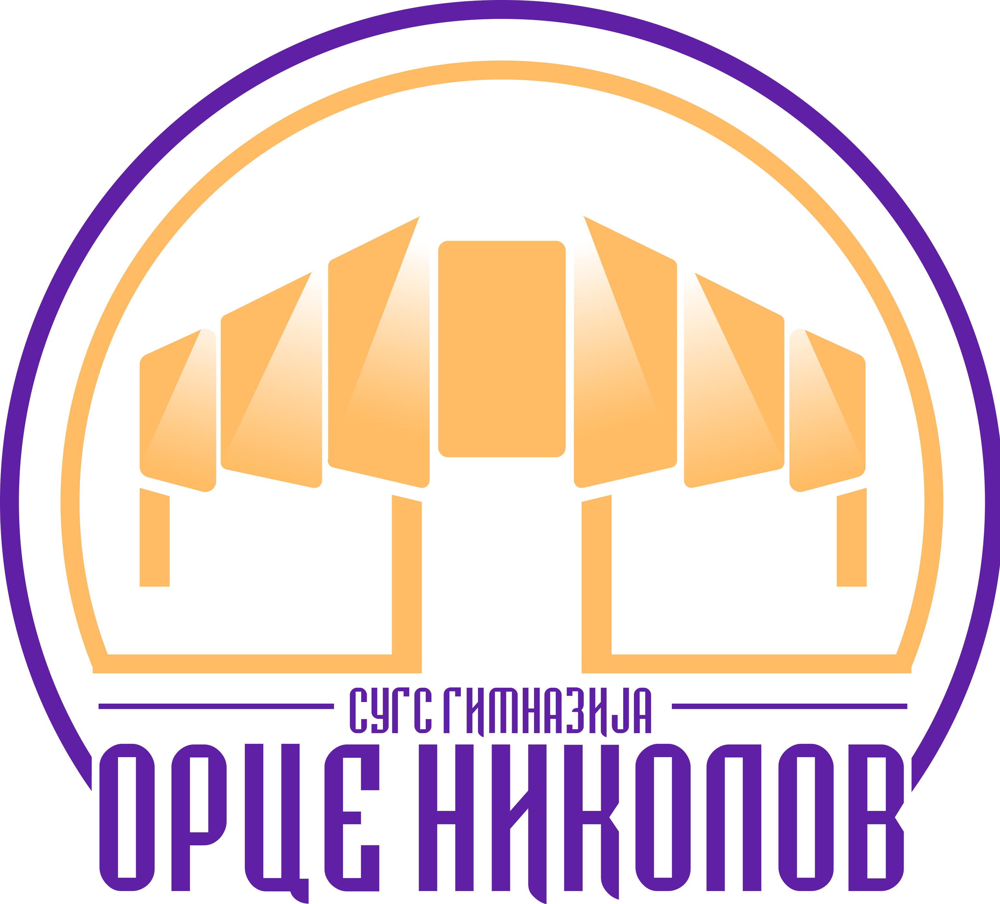

I spent my high school days in SUGSG Orce Nikolov. Among all of the subjects, I mostly learned mathematics and the basics of programming there.

After I graduated high school in 2023, I started university at The Faculty of Computer Science and Engineering (FCSE) within the UKIM. My major is Software Engineering and Information Systems.

